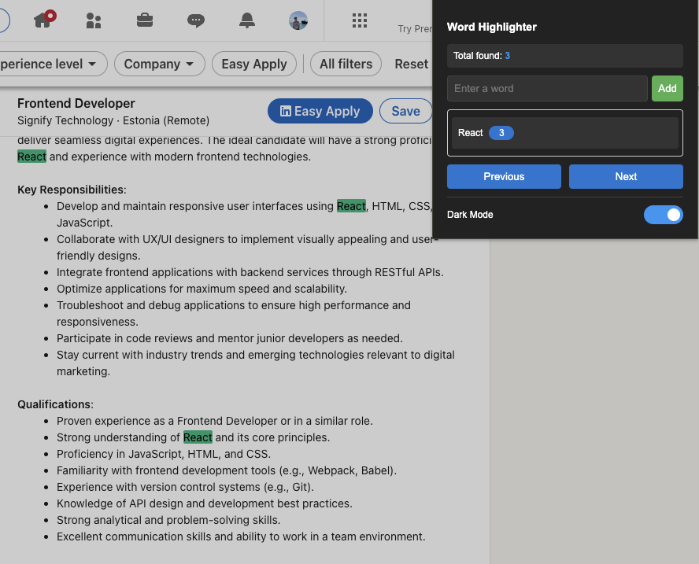

<h1 align="center">Word Highlighter Chrome Extension</h1>

<p align="center">
  
</p>

<p align="center">
  <a href="https://github.com/Mrezagolbaba/word-highlighter/blob/main/LICENSE">
    
  </a>
  <a href="https://github.com/Mrezagolbaba/word-highlighter/stargazers">
    
  </a>
  <a href="https://github.com/Mrezagolbaba/word-highlighter/issues">
    
  </a>
</p>

<p align="center">
  A powerful Chrome extension that helps you highlight and navigate through specific words on any webpage, with real-time word counting and dark mode support.
</p>

<h2>✨ Features</h2>
<ul>
  <li>✨ Highlight multiple words simultaneously</li>
  <li>🔍 Real-time word counting for each term</li>
  <li>⚡ Instant highlighting as you type</li>
  <li>🎯 Navigate between highlights with Previous/Next buttons</li>
  <li>🌓 Dark mode support</li>
  <li>📊 Word count statistics</li>
  <li>💪 Works on any webpage</li>
  <li>🚀 Fast and lightweight</li>
  <li>🔄 Supports dynamic content (infinite scroll)</li>
</ul>

<h2>📥 Installation</h2>

<h3>From Chrome Web Store</h3>
<ol>
  <li>Visit <a href="#">Word Highlighter on Chrome Web Store</a></li>
  <li>Click "Add to Chrome"</li>
  <li>Click "Add Extension" in the popup</li>
</ol>

<h3>Manual Installation (Developer Mode)</h3>
<ol>
  <li>Download or clone this repository</li>
  <li>Open Chrome and go to <code>chrome://extensions/</code></li>
  <li>Enable "Developer mode" in the top right</li>
  <li>Click "Load unpacked"</li>
  <li>Select the <code>src</code> directory from the downloaded/cloned repository</li>
</ol>

<h2>📸 Screenshots</h2>

<p align="center">
  
  <br>
  <em>Word Highlighter working on LinkedIn with colorful highlights</em>
</p>

<h2>🚀 Usage</h2>
<ol>
  <li>Click the extension icon in Chrome toolbar</li>
  <li>Enter words you want to highlight</li>
  <li>Use Previous/Next buttons to navigate between highlights</li>
  <li>Toggle dark mode as needed</li>
  <li>View word counts and statistics</li>
</ol>

<h2>💻 Development</h2>

<h3>Prerequisites</h3>
<ul>
  <li>Google Chrome</li>
  <li>Git</li>
  <li>Text editor (VS Code recommended)</li>
</ul>

<h3>Setup</h3>

```bash
# Clone the repository
git clone https://github.com/Mrezagolbaba/word-highlighter.git

# Navigate to project directory
cd word-highlighter

# Open in VS Code
code .
```
<h3>Project Structure</h3>

```
word-highlighter/
├── assets/
│   ├── icons/         # Extension icons (16px, 32px, 48px, 128px)
│   └── images/        # Logo and screenshots
├── src/
│   ├── js/           # JavaScript modules (modular architecture)
│   │   ├── colors.js     # Color management and themes (39 lines)
│   │   ├── highlighter.js # Core highlighting logic (120 lines)
│   │   ├── navigation.js  # Highlight navigation controls (72 lines)
│   │   ├── linkedin.js    # LinkedIn-specific functionality (45 lines)
│   │   ├── main.js        # Main initialization and events (135 lines)
│   │   └── popup.js       # Popup interface logic
│   └── css/          # Stylesheets
│       └── styles.css     # Main styles for popup
├── docs/             # GitHub Pages documentation
│   └── index.html    # Documentation website
├── popup.html        # Extension popup interface
├── manifest.json     # Extension manifest (V3)
├── PERFORMANCE_NOTES.md # Performance optimization details
└── README.md         # This file
```

<h3>Module Overview</h3>

- **🎨 colors.js**: Manages vibrant color palettes for light/dark modes with 10 distinct colors per word
- **🔍 highlighter.js**: Core text highlighting with performance optimizations and hidden content detection
- **🧭 navigation.js**: Previous/Next navigation with smooth scrolling and visual indicators
- **💼 linkedin.js**: Specialized functions for LinkedIn's dynamic content and collapsed job ads
- **⚙️ main.js**: Orchestrates all modules, handles events, and manages extension lifecycle
<h2>🤝 Contributing</h2>
<ol>
  <li>Fork the repository</li>
  <li>Create a new branch (<code>git checkout -b feature/improvement</code>)</li>
  <li>Make changes</li>
  <li>Commit changes (<code>git commit -am 'Add new feature'</code>)</li>
  <li>Push to branch (<code>git push origin feature/improvement</code>)</li>
  <li>Create Pull Request</li>
</ol>
<h2>📝 License</h2>
<p>
  This project is licensed under the MIT License - see the <a href="LICENSE">LICENSE</a> file for details.
</p>
<h2>👥 Authors</h2>
<ul>
  <li>Mohamadreza Golbaba - Initial work - <a href="https://github.com/Mrezagolbaba">GitHub</a></li>
</ul>
<h2>🙏 Acknowledgments</h2>
<ul>
  <li>Thanks to all contributors</li>
  <li>Inspired by the need for better text analysis tools</li>
</ul>
<hr>
<p align="center">
  Made with ❤️ by <a href="https://github.com/Mrezagolbaba">Mohamadreza Golbaba</a>
</p>
